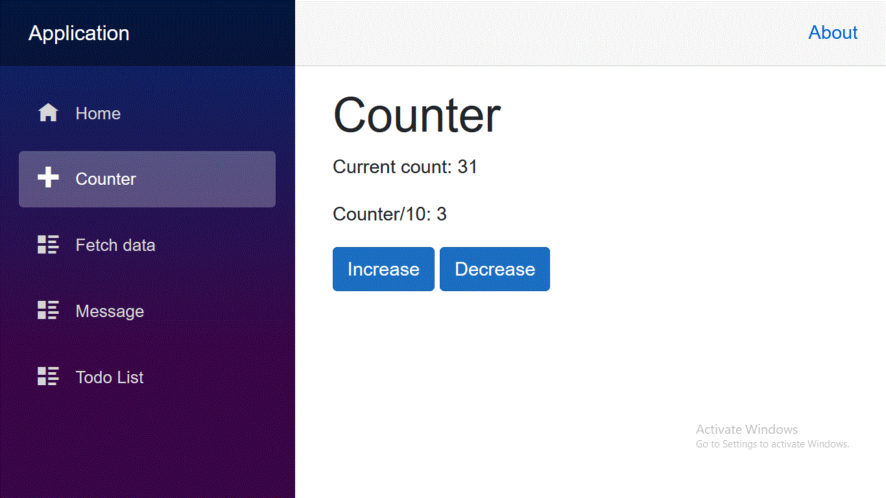

# Blazor-Project

# A) Technologies used:
1. C#
2. ASP.NET Core
3. Blazor

# B) Pages:

## B-1) Counter:

The increase button increses the counter.  
The decrease button decreases the counter.  
The counter/10 field descripes teh division of the counter over 10.

